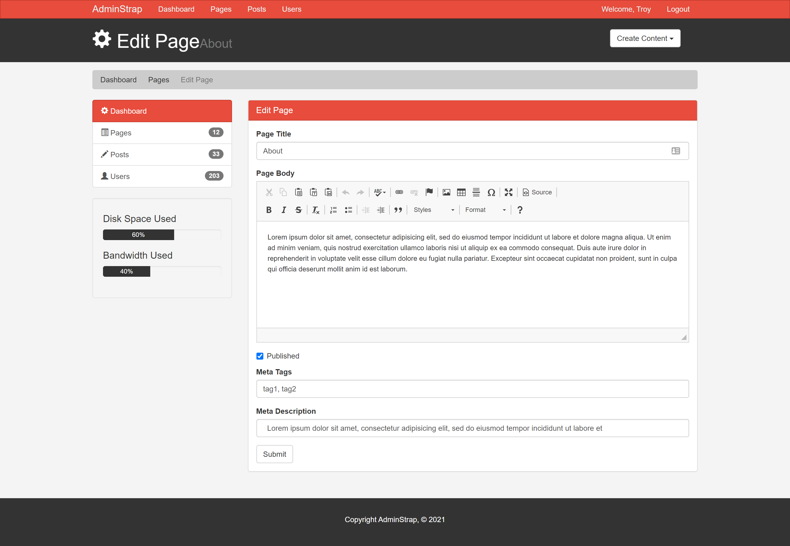

# HTML & CSS - Admin CMS Dashboard w/Twitter Bootstrap CSS Framework

### Live Demo

https://cmsadm1n.netlify.app/

### About

This project we utilize Twitter Bootstrap CSS framework to build the user interface for an administrator content management system (CMS) dashboard. The dashboard features the ability to track posts, pages, users and a login page using the majority of available Bootstrap components as well as a third-party blog post creation editor that looks really slick.

### Acknowledgement

Thanks to Traversy Media for another great tutorial!
